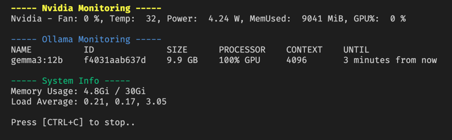

# System Monitor

## Description

This script provides a real-time monitoring solution for systems running local Ollama models with an Nvidia GPU. It combines insights from Nvidia GPU utilization, Ollama model performance, and overall system information, allowing you to ensure optimal resource allocation and prevent GPU memory overflow.  This is particularly helpful for keeping track of resource usage during model inference and identifying potential bottlenecks.



## Prerequisites

Before running this script, you'll need to ensure the following are installed and configured on your system:

*   **Bash Shell:** This script is written for Bash.
*   **Nvidia Drivers:**  Ensure your Nvidia drivers are properly installed and functioning.
*   **Ollama:**  Install and configure Ollama: [https://ollama.com/](https://ollama.com/)
*   **`nvidia-smi`:** This utility (part of the Nvidia driver suite) is essential for monitoring GPU usage. Verify it's in your PATH.
*   **`grep` & `awk`:**  Common Linux utilities for text processing.

## Usage

1.  **Make the script executable:**
    ```bash
    chmod +x monitor
    ```

2.  **Run the script:**
    ```bash
    ./monitor
    ```

The script will continuously display monitoring data in the terminal.  Press `Ctrl+C` to stop the script.

## Script Components

The script incorporates monitoring routines for:

*   **Nvidia GPU:** Tracks GPU utilization, memory usage, and temperature.
*   **Ollama:** Displays the currently running Ollama model and its status.
*   **System Info:** Provides basic system resource information (CPU, memory).

## Future Enhancements

*   **Logging:** Add the ability to log monitoring data to a file for later analysis.
*   **Alerting:** Implement alerts for critical events (e.g., GPU memory nearing capacity).
*   **GUI:** Consider developing a graphical user interface (GUI) for a more user-friendly experience.
*   **Customizable Metrics:**  Allow users to select which metrics they want to monitor.
*   **Configuration File:**  Move configuration options to a separate configuration file for easier management.
*   **Error Handling:** Improve error handling and provide more informative error messages.
*   **Python Integration:** Migrate to Python for cleaner logic.

## Behind the Scenes

This project was supported by a local AI model. The initial drafts of the documentation and some code structure were "vibe coded" with the help of Gemma 3, running locally. It's amazing what a bit of AI assistance can do!  Learn more about Gemma 3 [here](https://ai.google.dev/gemma) or explore the technical details [in the documentation](https://github.com/google-deepmind/gemma).

## License

[MIT License](https://opensource.org/licenses/MIT)
